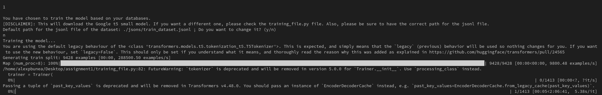
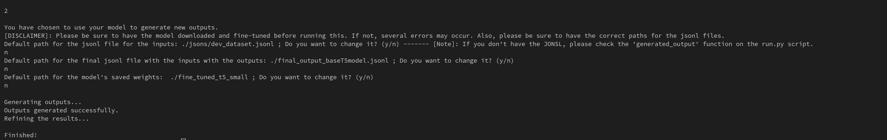
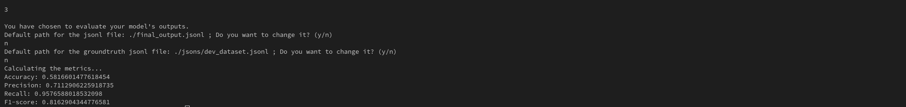

# ASSIGNMENT 1
-----------

The code found on this respository tries to develop a solution for identifying the source tables of a database, given a question on natural language (NL). For it, takes advantage of two artifial intelligence models trained by Google: flan-T5-small and flan-T5-base. By fine-tuning them and, later, refining the ouputs, the obtained metrics using the 'dev set' as groudtruth are:
- Flan-T5-small:
    - Accuracy: 0.5816601477618454
    - Precision: 0.7112906225918735
    - Recall: 0.9576588018532098
    - F1-score: 0.8162904344776581  
- Flan-T5-base: 
    - Accuracy: 0.6950021729682786
    - Precision: 0.7822152657193863
    - Recall: 0.980127173829771
    - F1-score: 0.8700584182858072   

Despite the fact that bigger models couldn't be used due to lower computational resources, the relative 'success' of the results is thanks to the hybrid approach that was employed and a very clear and efficient input format, for instance:
- Database ID: california_schools
- Question: What is the highest eligible free rate for K-12 students in the schools in Alameda County?
- Select table(s) from: ['frpm', 'satscores', 'schools']

### How do I execute the program?

Well, for the good of your mental health, one single file needs to be runned: 'run.py', however is recommended to do it directly on the terminal and not using the default executer on any IDLE like Visual Studio Code or PyCharm.
So, to start the program:
`python run.py`

Without any arguments, it will ask for what you want to do: train, generate, evaluate or exit.

#### Train

When selection option number 1, train, the program first with ask you if you would like to change the train dataset directory, which by default is './jsons/train_dataset.jsonl'. Keep in mind that, if you decide to change it, a maximum length of 512 for the input and 64 for the output is permited. Feel free to modify them if needed, as this numbers where chosen due to not having enough GPU memory.
After this, the model will be dowloaded (Google flan-T5-small), the dataset will be tokenized and the training/fine-tuning will start. When finished, the default directory of the saved weigths is './fine_tuned_t5_small'.

[Note]: You can also execute the training directly by running `python run --action "train"` 

Here is an ilustration:

#### Generate

When selecting option number 2, generating, the program will ask you three questions:
- Default path for the jsonl file for the inputs: ./jsons/dev_dataset.jsonl ; Do you want to change it? (y/n) ------- [Note]: If you don't have the JONSL, please check the 'generated_output' function on the run.py script.
- Default path for the final jsonl file with the inputs with the outputs: ./final_output_baseT5model.jsonl ; Do you want to change it? (y/n)
- Default path for the model's saved weights:  ./fine_tuned_t5_small ; Do you want to change it? (y/n)

Once finished answering those questions, the model will start to generate the outputs. Unfortunatly, the model tends to sometimes duplicate the ouput table, for example: ["schools", "schools"], which is undoubtivly wrong. That's when the refining takes place and makes sure there are no duplicates, that the tables are present in the database, and corrects, if needed, by similarity, their names, ex: ["scores"] ---> ["satscores"].

[Note]: You can also execute the training directly by running `python run --action "generate"`. Also, please check the run.py code, the generating function, if you need to create the jsonl for the databases. When executed that part of code, the jsonl will be created with inputs and outputs. The inputs are only used when generating, and the outputs are the groundtruth for the evaluation part. With this approach, much time is saved, and the totally of the program is more simple.

Another ilustration:

#### Evaluate

Finally, the last, but not the least important part of the proyect is to evaluate the results. When selecting option number 3, the model will ask two questions:
- Default path for the jsonl file: ./final_output.jsonl ; Do you want to change it? (y/n)
- Default path for the groundtruth jsonl file: ./jsons/dev_dataset.jsonl ; Do you want to change it? (y/n)

Once finished answering those questions, the program will calculate the metrics against the grounftruth.

[Note]: You can also execute the training directly by running `python run --action "evaluate"`.

Final ilustration:

### Hope everything is clear. Thank you so much
### Alexander Perez Bunea

    

